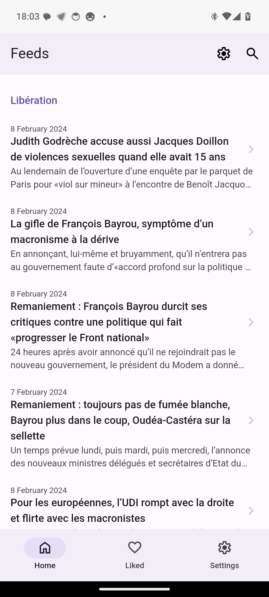
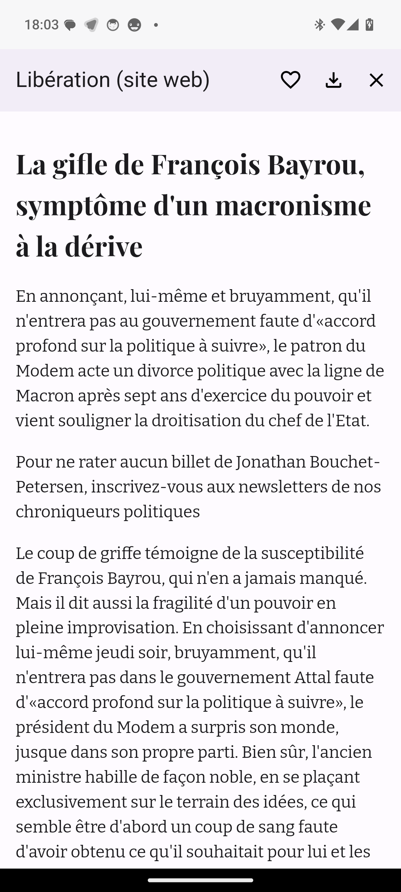
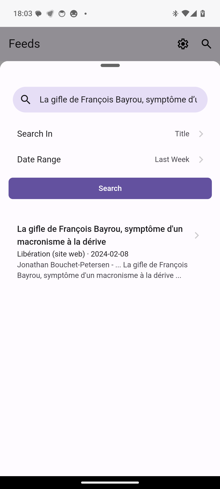
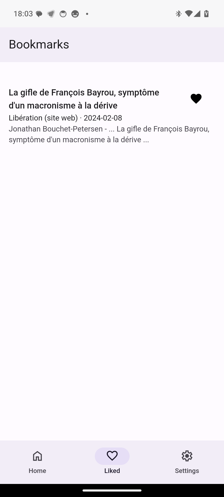
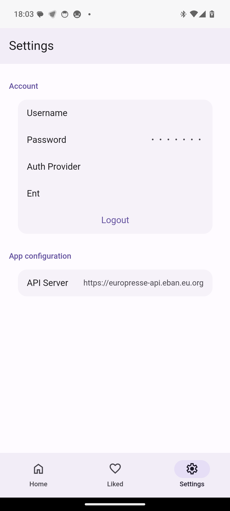

# 📰 Gazette

## Description

A mobile app client for Europresse. It is based on Framework7 and Capacitor and uses [Europresse API](https://github.com/ebanDev/europresse-api).

Home             |  Article | Search | Bookmarks | Settings
:-------------------------:|:-------------------------:|:-------------------------:|:-------------------------:|:-------------------------:
 |   |  |  | 

## Features

- [x] 🆕 See latest articles on home page from RSS feeds
- [x] 🔍 Search articles
- [x] 📰 Read article
- [x] 💾 Save article
- [x] 📁 Export article

## Development

### Install Dependencies

First of all we need to install dependencies, run in terminal
```
npm install
```

### NPM Scripts

* 🔥 `start` - run development server
* 🔧 `dev` - run development server
* 🔧 `build` - build web app for production
* 📱 `build-capacitor-android` - build app and copy it to Android capacitor project

### Vite

There is a [Vite](https://vitejs.dev) bundler setup. It compiles and bundles all "front-end" resources. You should work only with files located in `/src` folder. Vite config located in `vite.config.js`.
### Capacitor

This project created with Capacitor support. And first thing required before start is to add capacitor platforms, run in terminal:

```
npx cap add android
```

Check out [official Capacitor documentation](https://capacitorjs.com) for more examples and usage examples.